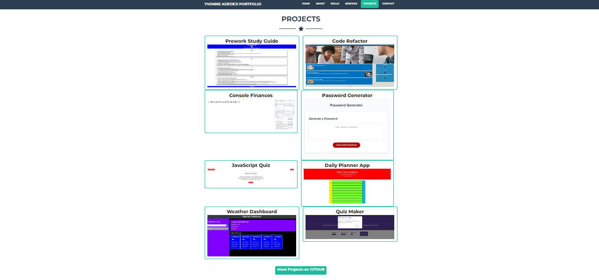

# portfolio

## Description
The Portfolio Web App Project is a responsive and modern web application designed to showcase your work, skills etc. Built using HTML, CSS and Bootstrap, this portfolio template provides an elegant and professional platform to present your projects.

Portfolio for Yvonne Adedeji - Front-End Web Developer. Recreate my personal portfolio using Bootstrap to showcase my projects. 

## Prerequisites
N/A

## Criteria
Using Bootstrap, recreate your portfolio site with the following items:
* A Navigation bar and a navigation menu at the top.
* Include links that are applicable to your portfolio. Links should navigate to the appropriate sections
* A banner featuring your picture, your name, and any other information you'd like to include.
* A work section that displays your work in grid.
Use bootstrap cards for each project, included bootstrap model for each project. The description should give a brief overview of the work.
* A skills section
* An "About Me" section
* A  Services section
* A footer section.

## Technologies Used
Built with:
This portfolio was created using
* HTML
* CSS
* JavaScript
* (Bootstrap)

## Installation
N/A

## Usage
N/A

## Project Link
Application can can be viewed here: 
* [Live](https://yvonnesarah.github.io/portfolio/)

* [Repository](https://github.com/yvonnesarah/portfolio)

## Screenshot(S)
Portfolio - Home Section

Portfolio - About Me Section

Portfolio - Skills Section

Portfolio - Services Section

Portfolio - Projects Section

Portfolio - Contact Me Section

## Credit
N/A

## Licence
Please refer to the LICENSE in the repo.
